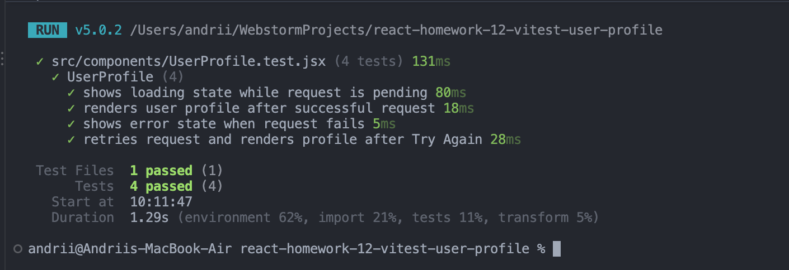

# React Homework 12 — Async User Profile Testing

A small React application created to practice testing asynchronous component logic with Vitest and React Testing Library.

The `UserProfile` component fetches user data from JSONPlaceholder and handles the three main states of an asynchronous request: loading, success, and error.

## Live Demo

https://andrii-dolzhenko.github.io/react-homework-12-vitest-user-profile/

## Features

- Fetches user data asynchronously from JSONPlaceholder
- Displays a loading state while the request is pending
- Renders user profile data after a successful request
- Displays an error state when the request fails
- Supports retrying a failed request with the `Try Again` button
- Generates user initials dynamically from the user's name
- Provides a responsive desktop and mobile interface
- Uses mocked `fetch` requests in tests without relying on the external API

## Testing

The project uses:

- Vitest
- React Testing Library
- Testing Library `jest-dom`
- Testing Library `user-event`
- jsdom

The `UserProfile` component is covered by four test scenarios:

1. Displays the loading state while the request is pending
2. Renders the user profile after a successful request
3. Displays the error state when the request fails
4. Retries the request and renders the profile after clicking `Try Again`

API requests are mocked during testing, so the test suite does not depend on the availability of the external service.

## Test Results

## Installation

~~~bash
git clone https://github.com/andrii-dolzhenko/react-homework-12-vitest-user-profile.git
cd react-homework-12-vitest-user-profile
npm install
~~~

## Run the Application

~~~bash
npm run dev
~~~

## Run Tests

~~~bash
npm test
~~~

Run Vitest in watch mode:

~~~bash
npm run test:watch
~~~

## Code Quality

Run Oxlint:

~~~bash
npm run lint
~~~

Create a production build:

~~~bash
npm run build
~~~

## Tech Stack

- React 19
- Vite
- Vitest
- React Testing Library
- jsdom
- Oxlint

## API

User data is loaded from:

~~~text
https://jsonplaceholder.typicode.com/users/1
~~~

## Author

© 2026 Andrii Dolzhenko. All Rights Reserved.
